# 나만의 프롬프트 관리자

Python 기본 문법을 활용하여 만든 콘솔 기반 프롬프트 관리 프로그램입니다.

자주 사용하는 프롬프트를 카테고리별로 관리하고, 제목이나 내용으로 검색할 수 있습니다. 필요한 프롬프트는 즐겨찾기에 등록하여 별도로 확인할 수 있습니다.

## 개발 환경

- Python 3.10 이상
- Visual Studio Code
- Git
- GitHub
- 별도의 외부 라이브러리 없이 Python 기본 문법으로 구현

Python과 Git 버전 및 사용자 설정을 확인했습니다.

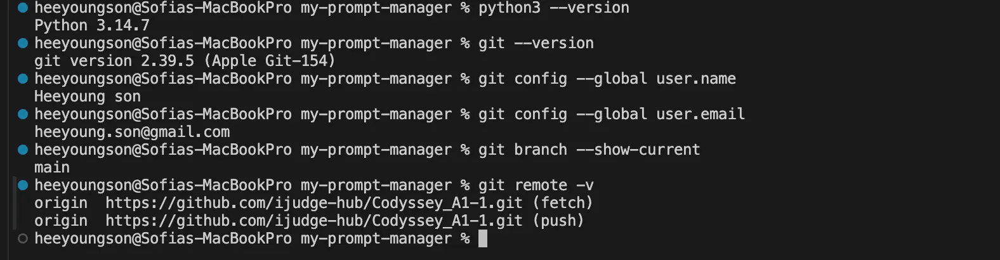

## 실행 방법

### 1. 저장소 내려받기

```bash
git clone https://github.com/ijudge-hub/Codyssey_A1-1.git
```

### 2. 프로젝트 폴더로 이동

```bash
cd Codyssey_A1-1
```

### 3. 프로그램 실행

```bash
python3 main.py
```

## 주요 기능

프로그램을 실행하면 다음 메뉴가 표시됩니다.

```text
=== 나만의 프롬프트 관리 ===
1. 프롬프트 추가
2. 프롬프트 목록
3. 카테고리별 조회
4. 프롬프트 검색
5. 프롬프트 상세 보기
6. 즐겨찾기 관리
7. 즐겨찾기 목록
0. 종료
```

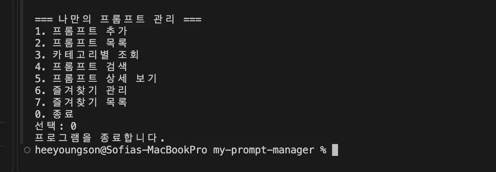

### 1. 프롬프트 추가

- 제목, 내용, 카테고리를 입력하여 새로운 프롬프트를 추가합니다.
- 제목이나 내용을 비워두면 다시 입력하도록 안내합니다.
- 카테고리는 기존 목록에서 선택하거나 직접 입력할 수 있습니다.
- 새 프롬프트의 즐겨찾기 기본값은 `False`입니다. 새로 추가한 프롬프트는 즐겨찾기에 등록되지 않은 상태로 저장됩니다.

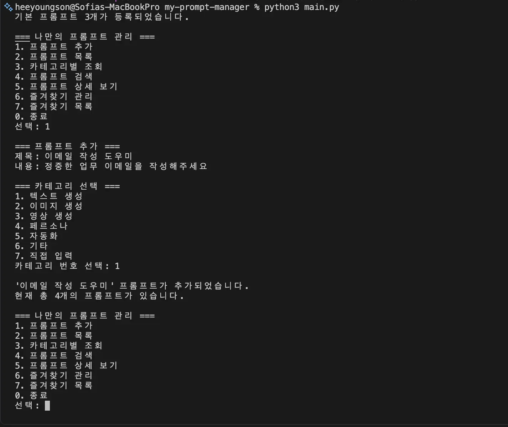

빈 값이나 잘못된 값을 입력하면 올바른 값을 다시 입력하도록 안내합니다.

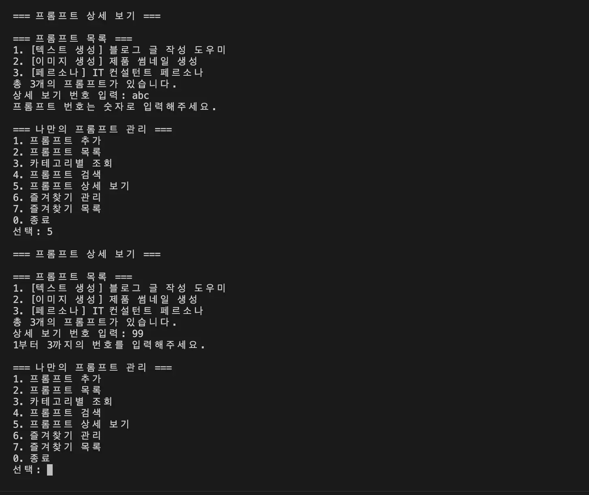

### 2. 프롬프트 목록

- 저장된 모든 프롬프트를 번호와 함께 출력합니다.
- 제목, 카테고리, 즐겨찾기 여부를 확인할 수 있습니다.
- 즐겨찾기된 프롬프트에는 `⭐`가 표시됩니다.

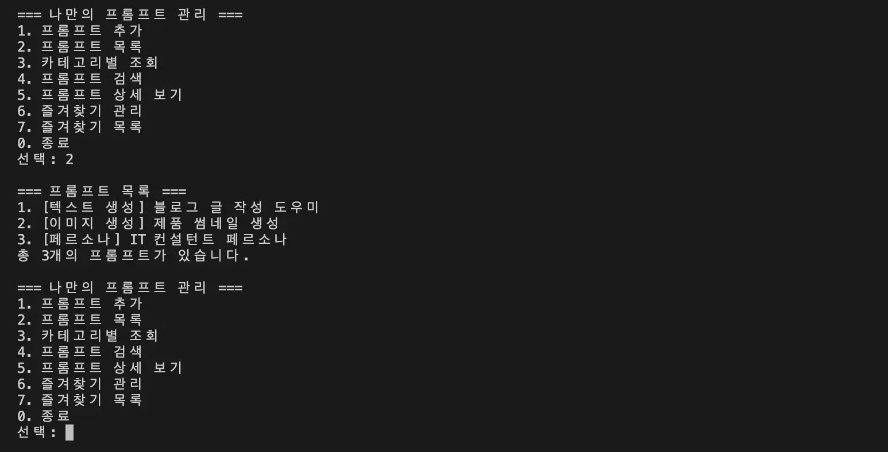

### 3. 카테고리별 조회

- 카테고리를 선택하여 해당 카테고리의 프롬프트만 조회합니다.
- 선택한 카테고리에 프롬프트가 없으면 안내 메시지를 출력합니다.

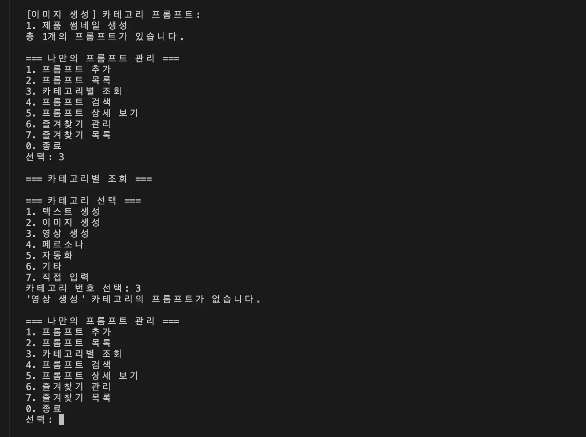

### 4. 프롬프트 검색

- 입력한 키워드가 제목 또는 내용에 포함된 프롬프트를 검색합니다.
- 영어 검색 시 대문자와 소문자를 구분하지 않습니다.
- 검색 결과가 없으면 안내 메시지를 출력합니다.

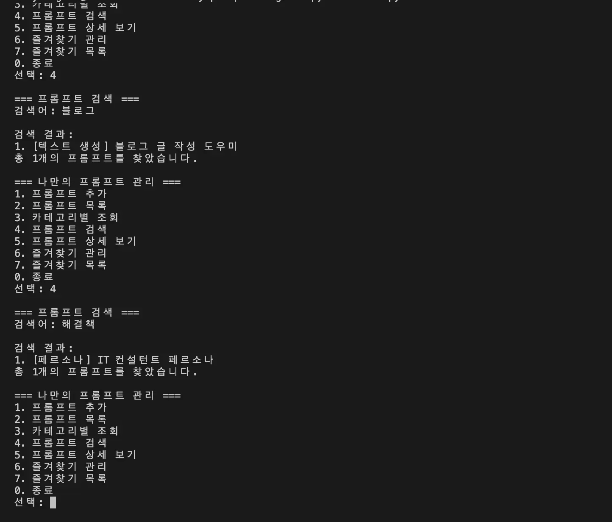

### 5. 프롬프트 상세 보기

- 프롬프트 번호를 입력하여 전체 내용을 확인합니다.
- 제목, 카테고리, 즐겨찾기 상태, 프롬프트 내용을 출력합니다.
- 숫자가 아닌 값이나 범위를 벗어난 번호를 입력하면 안내 메시지를 출력합니다.

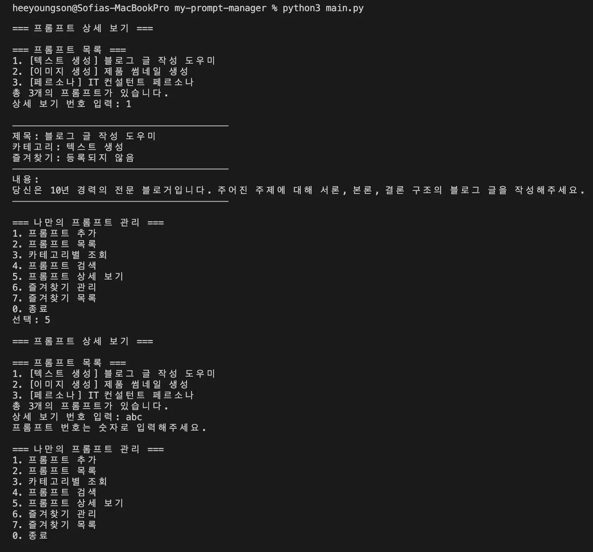

### 6. 즐겨찾기 관리

- 프롬프트 번호를 선택하여 즐겨찾기를 추가하거나 해제합니다.
- 현재 즐겨찾기 상태를 반대로 변경하는 방식으로 동작합니다.

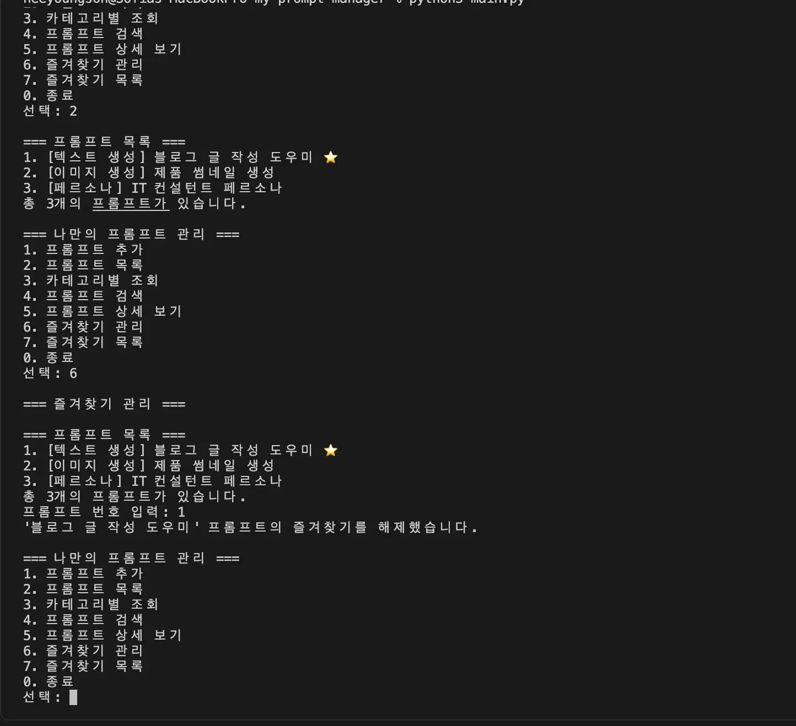

### 7. 즐겨찾기 목록

- 즐겨찾기로 등록된 프롬프트만 모아서 출력합니다.
- 즐겨찾기된 프롬프트가 없으면 안내 메시지를 출력합니다.

## 기본 카테고리

프로그램에서는 다음 카테고리를 기본으로 제공합니다.

- 텍스트 생성
- 이미지 생성
- 영상 생성
- 페르소나
- 자동화
- 기타

기본 목록에 없는 카테고리는 프롬프트 추가 과정에서 직접 입력할 수 있습니다.

## 기본 프롬프트 데이터

프로그램 시작 시 다음과 같은 기본 프롬프트 3개가 등록됩니다.

1. 블로그 글 작성 도우미
2. 제품 썸네일 생성
3. IT 컨설턴트 페르소나

각 프롬프트는 다음 정보를 딕셔너리로 관리합니다.

```python
{
    "title": "프롬프트 제목",
    "content": "프롬프트 내용",
    "category": "카테고리",
    "favorite": False,
}
```

여러 개의 프롬프트 딕셔너리는 하나의 리스트에 저장됩니다.

## 프로젝트 구조

```text
my-prompt-manager/
├── screenshots/
│   ├── environment-setup.webp
│   ├── main-menu.webp
│   ├── add-prompt.webp
│   ├── invalid-input.webp
│   ├── prompt-list.webp
│   ├── category-filter.webp
│   ├── prompt-search.webp
│   ├── prompt-detail.webp
│   ├── favorite-toggle.webp
│   ├── git-clone.webp
│   ├── git-clone-2.webp
│   ├── git-merge.webp
│   ├── git-log.webp
│   └── git-status-clean.webp
├── .gitignore
├── main.py
└── README.md
```

## 코드 구조

기능별로 함수를 분리하여 구성했습니다.

- `get_non_empty_input()` : 빈 입력값 검증
- `select_category()` : 카테고리 선택
- `add_prompt()` : 프롬프트 추가
- `show_list()` : 전체 목록 출력
- `show_by_category()` : 카테고리별 조회
- `search_prompt()` : 키워드 검색
- `show_detail()` : 상세 내용 출력
- `toggle_favorite()` : 즐겨찾기 추가·해제
- `show_favorites()` : 즐겨찾기 목록 출력
- `show_menu()` : 메뉴 출력과 사용자 선택
- `main()` : 프로그램 전체 실행 흐름 관리

## 데이터 유지 범위

프롬프트 데이터는 프로그램이 실행되는 동안 리스트에 저장됩니다. 프로그램을 종료하면 실행 중 추가한 프롬프트와 변경한 즐겨찾기 상태는 초기화됩니다.

## Git 활용

### 저장소 복제

공개 저장소를 `clone`하여 로컬로 내려받는 과정을 확인했습니다.

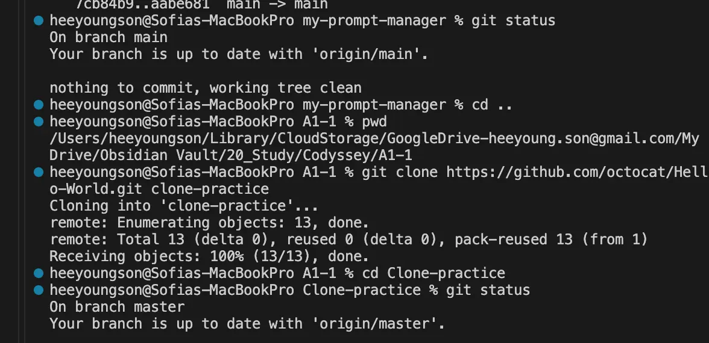

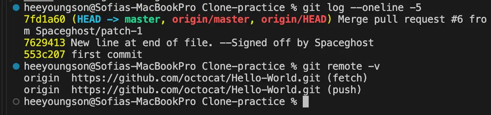

### 브랜치 작업

전체 프롬프트 목록 기능은 별도의 `feature/prompt-list` 브랜치에서 구현한 뒤 `main` 브랜치로 병합했습니다.

```bash
git checkout -b feature/prompt-list
git checkout main
git merge --no-ff feature/prompt-list
```

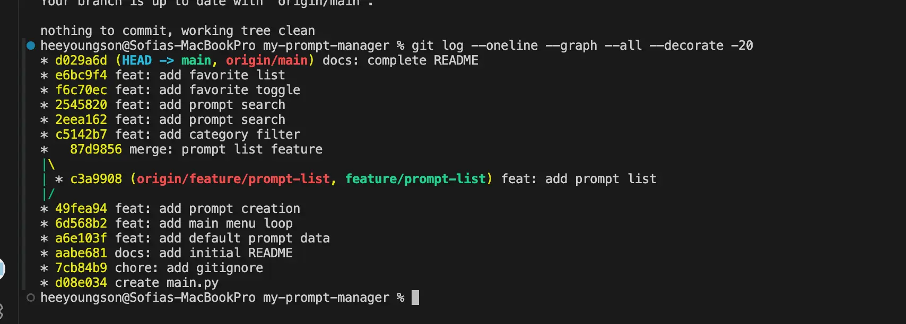

### 커밋 기록

기능별로 변경 사항을 커밋했으며, Git 로그 그래프를 통해 브랜치 생성과 병합 기록을 확인할 수 있습니다.

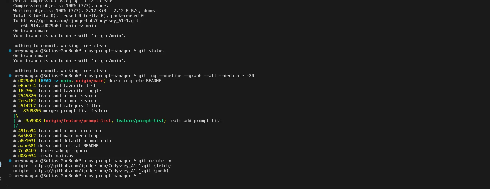

### 최종 저장소 상태

모든 변경 사항을 커밋하고 GitHub에 전송한 뒤 작업 폴더가 깨끗한 상태인지 확인했습니다.

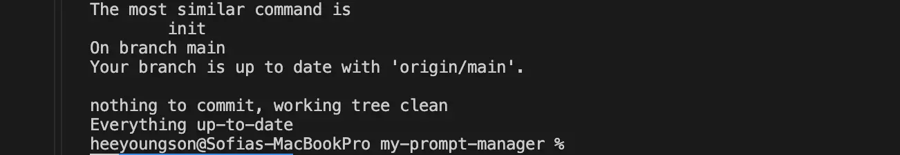

## 저장소

[GitHub 저장소 바로가기](https://github.com/ijudge-hub/Codyssey_A1-1)